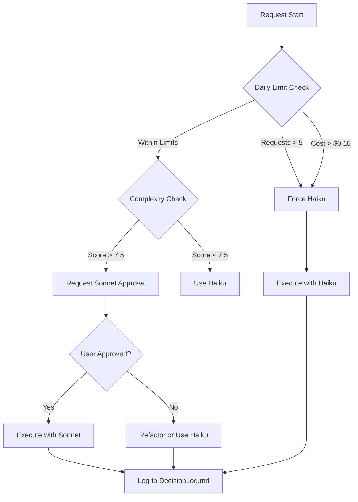

# Auto-Fallback & Cost Enforcement System

## 1. Request Counter System
```javascript
// Track daily usage
const DAILY_TRACKER = {
  requests: 0,
  cost: 0.0,
  lastReset: null,
  
  resetIfNeeded: function() {
    const today = new Date().toDateString();
    if (this.lastReset !== today) {
      this.requests = 0;
      this.cost = 0.0;
      this.lastReset = today;
    }
  },
  
  addRequest: function(cost, model) {
    this.resetIfNeeded();
    this.requests++;
    this.cost += cost;
    
    return {
      requests: this.requests,
      cost: this.cost,
      canContinue: this.requests <= 5 && this.cost <= 0.10
    };
  }
};
```

## 2. Model Cost Estimation
```javascript
const MODEL_COSTS = {
  'haiku': {
    input: 0.00025,  // $0.25 per 1M tokens
    output: 0.0010,  // $1.00 per 1M tokens
    avg_per_request: 0.0008
  },
  'sonnet': {
    input: 0.0030,   // $3.00 per 1M tokens
    output: 0.0150,  // $15.00 per 1M tokens
    avg_per_request: 0.008
  }
};

function estimateCost(model, complexity, files) {
  const baseCost = MODEL_COSTS[model].avg_per_request;
  const multiplier = Math.max(1, files.length * 0.3 + complexity * 0.1);
  return baseCost * multiplier;
}
```

## 3. Fallback Decision Engine


## 4. Fallback Triggers & Actions
```javascript
const FALLBACK_TRIGGERS = {
  // Hard limits
  'request_count_exceeded': {
    condition: (state) => state.requests > 5,
    action: 'force_haiku',
    message: 'Daily request limit reached (5/5). Switching to Haiku.'
  },
  
  'cost_exceeded': {
    condition: (state) => state.cost > 0.10,
    action: 'force_haiku',
    message: 'Daily cost cap ($0.10) exceeded. Switching to Haiku.'
  },
  
  // Soft limits
  'high_complexity': {
    condition: (state) => state.complexity > 7.5 && !state.approved,
    action: 'request_approval',
    message: '⚠️ High complexity detected. Sonnet recommended for optimal results.'
  },
  
  'logic_loop': {
    condition: (state) => state.failed_attempts >= 3,
    action: 'suggest_refactor',
    message: 'Multiple failed attempts. Consider refactoring into smaller tasks.'
  },
  
  'memory_conflict': {
    condition: (state) => state.memoryConflict,
    action: 'log_and_continue',
    message: 'Memory Bank conflict detected. Logging and continuing with Haiku.'
  }
};
```

## 5. Implementation in ACT Mode
```markdown
# ACT Mode Execution
**Task:** [Task Name]
**Complexity:** X.X/10
**Model:** Haiku (Free)
**Chunk:** 1/3

**Daily Usage:**
- Requests: 3/5
- Cost: $0.0024/$0.10
- Status: ✅ Within limits

**Progress:**
- [x] Pattern analysis
- [x] File reads
- [ ] Implementation

**Fallback Status:** None
**Cost:** $0.0008 (running total: $0.0032)
```

## 6. Emergency Fallback Protocol
```javascript
function emergencyFallback(error, context) {
  // Log the failure
  logToDecisionLog({
    timestamp: new Date().toISOString(),
    task: context.task,
    error: error.message,
    attemptedModel: context.model,
    fallbackTo: 'haiku',
    reason: 'emergency_fallback'
  });
  
  // Reset state
  context.model = 'haiku';
  context.failed_attempts = (context.failed_attempts || 0) + 1;
  
  // Alert user
  if (context.failed_attempts >= 3) {
    return {
      action: 'halt_and_refactor',
      message: 'Multiple failures detected. Please refactor task into smaller chunks.'
    };
  }
  
  return {
    action: 'retry_with_haiku',
    message: `Error with ${context.model}. Retrying with Haiku.`
  };
}
```

## 7. Cost Optimization Strategies
```markdown
### 7.1 File Chunking
- **Max 3 files per request**
- **Batch related changes**
- **Use replace_in_file for surgical edits**

### 7.2 Pattern Reuse
- **Check Memory Bank first**
- **Avoid duplicate work**
- **Leverage existing patterns**

### 7.3 Model Selection
- **Haiku for simple edits (2-4/10)**
- **Haiku for standard components (4-6/10)**
- **Request Sonnet for complex logic (7.5+/10)**
- **Force Haiku after 5 requests**
```

## 8. Verification & Testing
```markdown
### Test Scenarios
1. **Request Limit Test**
   - Make 5 requests
   - Verify 6th forces Haiku

2. **Cost Cap Test**
   - Simulate $0.09 usage
   - Verify next request forces Haiku

3. **Complexity Test**
   - Simple task: Should use Haiku
   - Complex task: Should request Sonnet approval

4. **Emergency Fallback Test**
   - Simulate 3 failures
   - Verify halt + refactor suggestion
```

## 9. Integration Checklist
- [ ] Add request counter to session management
- [ ] Implement cost estimation in PLAN mode
- [ ] Add fallback alerts to user interface
- [ ] Create emergency fallback handler
- [ ] Update progress tracking with cost data
- [ ] Add verification tests
