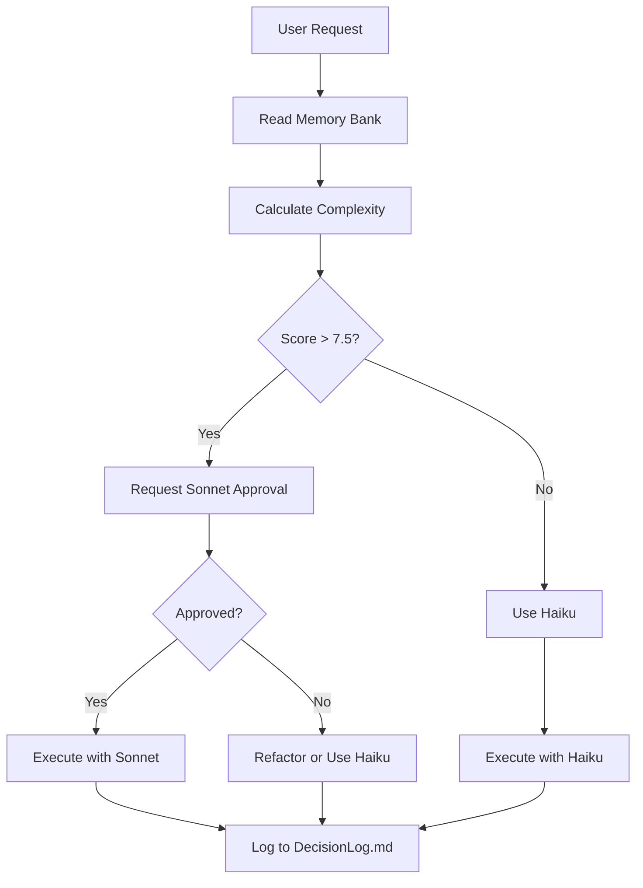

# Complexity Calculator & Model Selection Utility

## Complexity Scoring System

### 1. Base Complexity Scores
```javascript
const BASE_COMPLEXITY = {
  'simple-edit': 2.0,        // Single file, few lines
  'component-add': 4.0,      // New component + styles
  'api-integration': 5.5,    // API calls + state management
  'auth-flow': 6.2,          // Authentication logic
  'state-refactor': 7.0,     // Complex state changes
  'algorithm-logic': 8.5,    // Mathematical/algorithmic
  'architecture-change': 9.0 // Cross-cutting concerns
}
```

### 2. Multiplier Factors
```javascript
const MULTIPLIERS = {
  fileCount: (count) => Math.min(count * 0.5, 3.0),  // Max +3.0
  dependencies: (count) => count * 0.3,              // +0.3 per dep
  edgeCases: (count) => count * 0.4,                 // +0.4 per edge case
  existingPattern: (exists) => exists ? -1.5 : 0,    // -1.5 if pattern exists
  memoryBankMatch: (match) => match ? -2.0 : 0       // -2.0 if MB match
}
```

### 3. Complexity Calculator Function
```javascript
function calculateComplexity(task, files, memoryBank) {
  let score = BASE_COMPLEXITY[task.type] || 5.0;
  
  // File count impact
  score += MULTIPLIERS.fileCount(files.length);
  
  // Dependency impact
  score += MULTIPLIERS.dependencies(files.length - 1);
  
  // Edge case analysis
  const edgeCases = analyzeEdgeCases(files);
  score += MULTIPLIERS.edgeCases(edgeCases);
  
  // Pattern matching
  const hasPattern = checkExistingPatterns(files, memoryBank);
  score += MULTIPLIERS.existingPattern(hasPattern);
  
  // Memory Bank match
  const mbMatch = checkMemoryBank(task, memoryBank);
  score += MULTIPLIERS.memoryBankMatch(mbMatch);
  
  // Clamp to 0-10 range
  return Math.max(0, Math.min(10, score));
}
```

### 4. Model Selection Logic
```javascript
function selectModel(complexity, userApproved = false) {
  // Free tier enforcement
  if (getTodayRequestCount() > 5) {
    return 'haiku';
  }
  
  if (getTodayCost() > 0.10) {
    return 'haiku';
  }
  
  // Complexity-based selection
  if (complexity > 7.5 && userApproved) {
    return 'sonnet';
  }
  
  return 'haiku';
}
```

### 5. Edge Case Detection
```javascript
function analyzeEdgeCases(files) {
  let count = 0;
  
  files.forEach(file => {
    // Check for error handling
    if (file.includes('try/catch') || file.includes('error')) count++;
    
    // Check for conditional logic
    if (file.includes('if') || file.includes('switch')) count++;
    
    // Check for async operations
    if (file.includes('async') || file.includes('await')) count++;
    
    // Check for complex state
    if (file.includes('useReducer') || file.includes('setState')) count++;
  });
  
  return count;
}
```

### 6. Pattern Matching
```javascript
function checkExistingPatterns(files, memoryBank) {
  const patterns = memoryBank.getPatterns();
  
  return files.some(file => {
    return patterns.some(pattern => {
      return file.includes(pattern.code) || 
             file.includes(pattern.structure);
    });
  });
}
```

### 7. Memory Bank Integration
```javascript
function checkMemoryBank(task, memoryBank) {
  const context = memoryBank.activeContext;
  
  // Check for similar tasks
  const similarTasks = context.recentTasks.filter(t => 
    t.type === task.type && t.success
  );
  
  // Check for existing implementations
  const existing = context.files.filter(f => 
    f.path.includes(task.name) || f.tags.includes(task.type)
  );
  
  return similarTasks.length > 0 || existing.length > 0;
}
```

### 8. Usage in PLAN Mode
```markdown
## PLAN Mode Output
**Complexity Analysis:**
- Base Score: 4.0 (Component Add)
- File Count: 2 (+1.0)
- Dependencies: 1 (+0.3)
- Edge Cases: 2 (+0.8)
- Pattern Match: Yes (-1.5)
- Memory Bank: Match (-2.0)
- **Final Score: 2.6/10**

**Model Selection:** Haiku (Free)
**Cost Estimate:** $0.0015
**Files to Modify:** 2
```

### 9. Usage in ACT Mode
```markdown
# ACT Mode Execution
**Task:** Add UserProfile Component
**Complexity:** 2.6/10
**Model:** Haiku (Free)
**Chunk:** 1/2

**Progress:**
- [x] Read UserProfile.jsx
- [x] Read UserContext.jsx
- [x] Analyze patterns
- [ ] Implement changes

**Cost:** $0.0008 (running total)
```

### 10. Auto-Fallback Triggers
```javascript
const FALLBACK_TRIGGERS = [
  { condition: 'request_count > 5', action: 'force_haiku' },
  { condition: 'cost_today > 0.10', action: 'force_haiku' },
  { condition: 'complexity > 7.5 && !approved', action: 'request_approval' },
  { condition: 'failed_attempts >= 3', action: 'suggest_refactor' },
  { condition: 'memory_bank_conflict', action: 'log_and_continue' }
];
```

### 11. Integration Checklist
- [ ] Add complexity calculator to PLAN mode
- [ ] Integrate with memory bank reads
- [ ] Add cost estimation display
- [ ] Implement auto-fallback logic
- [ ] Update progress tracking
- [ ] Log decision points

### 12. Example Decision Tree


This calculator ensures optimal model selection while maintaining free-tier compliance.
