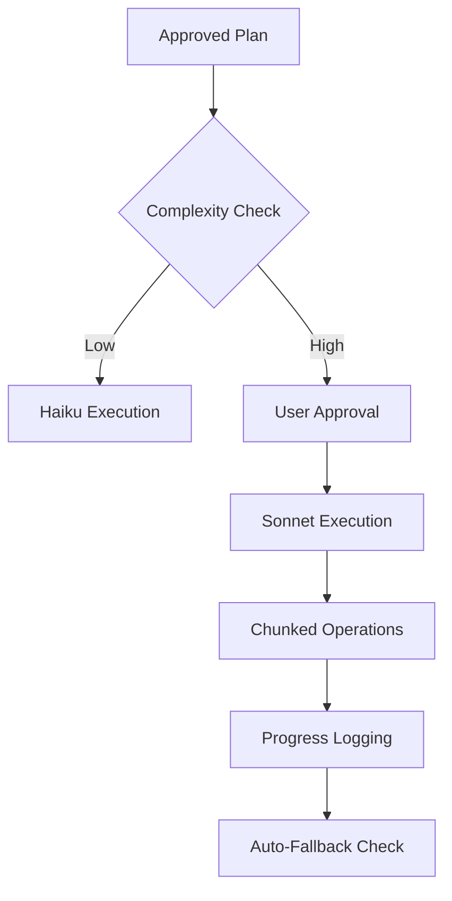
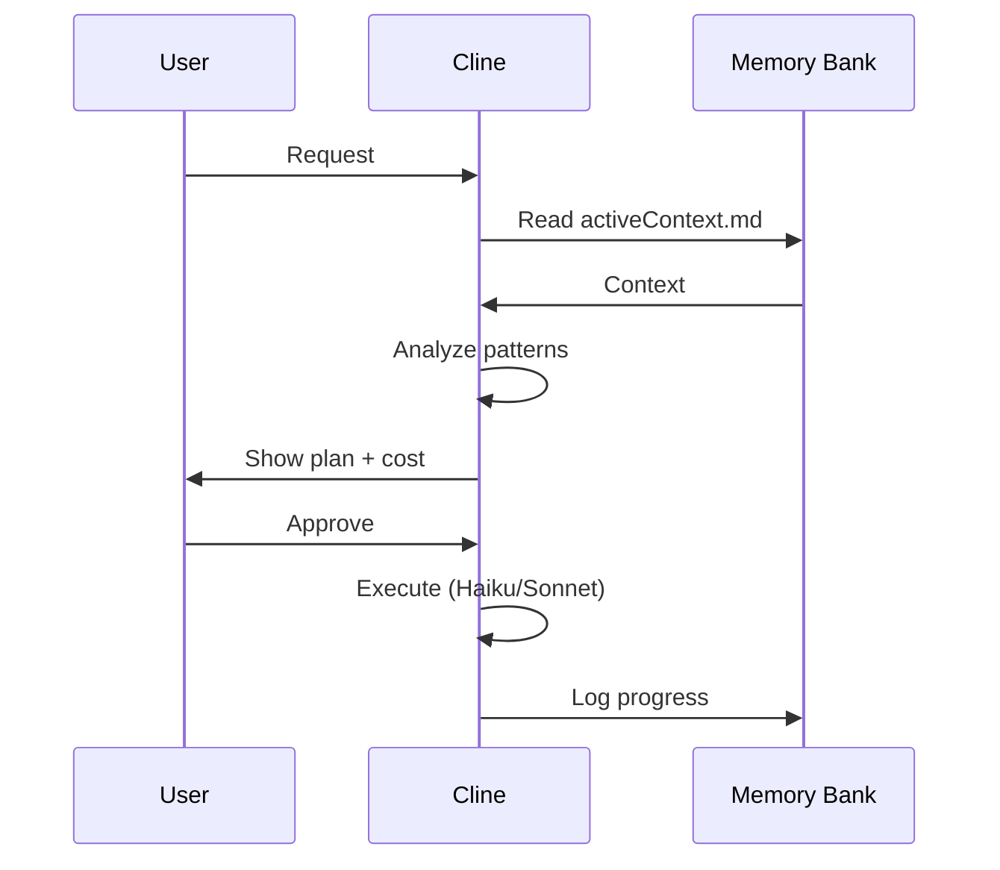
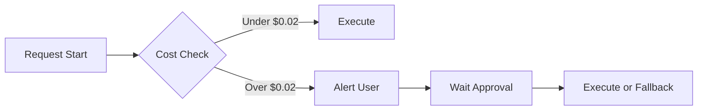

# Sonnet-Style Logging & Optimization Protocol
## Free Model Enhancement Framework

### 1. PLAN Mode Sonnetification
```mermaid
graph TD
    A[User Request] --> B[Memory Bank Analysis]
    B --> C[Strategic File Reads (Max 3)]
    C --> D[Pattern Recognition]
    D --> E[Cost Estimation]
    E --> F[Blueprint Generation]
    F --> G[User Approval Gate]
```

**Enhanced Logging Features:**
- **Contextual Pre-Analysis**: Auto-read `activeContext.md` + last 3 `progress.md` entries
- **Pattern Extraction**: Identify recurring code patterns before planning
- **Cost Preview**: Show estimated token usage before execution
- **Decision Tree**: Log reasoning path in `memory-bank/decisionLog.md`

### 2. ACT Mode Surgical Execution


**Execution Protocol:**
- **Chunking**: Max 3 files per request
- **Model Selection**: 
  ```javascript
  function selectModel(task) {
    const complexity = calculateComplexity(task);
    if (complexity > 7.5 && userApproved) return 'sonnet';
    return 'haiku'; // Default free tier
  }
  ```
- **Auto-Fallback**: After 5 paid requests, switch to Haiku
- **Progress Tracking**: Real-time updates in `memory-bank/progress.md`

### 3. Log Enhancement Features

#### 3.1 Decision Logging
```markdown
# memory-bank/decisionLog.md
## [Timestamp] Task: Authentication Flow
- **Model Used**: Haiku (Free)
- **Complexity Score**: 6.2/10
- **Files Modified**: 2
- **Reasoning**: 
  - Pattern match: Auth flow exists in `auth.py`
  - Memory Bank: MB#2024-07-AUTH
  - Cost: 0.002 USD
```

#### 3.2 Audit Trail


### 4. Cost Optimization Safeguards

#### 4.1 Free Tier Enforcement
```python
def enforce_free_tier():
    daily_cap = 0.10  # USD
    request_count = get_today_requests()
    
    if request_count > 5:
        return "haiku"  # Force free model
    
    if get_today_cost() > daily_cap:
        return "haiku"
    
    return "auto"  # Respect user choice
```

#### 4.2 Budget Alerts


### 5. Implementation Checklist

- [ ] Create `sonnet-logging.md` (this file)
- [ ] Update `professional-dev-protocol.md` with logging hooks
- [ ] Modify `memory-bank-standard.md` for Sonnet-formatted storage
- [ ] Add complexity calculator utility
- [ ] Implement auto-fallback mechanism

### 6. Usage Examples

#### PLAN Mode with Enhanced Logging
```markdown
# PLAN Mode Output
## Task: Add User Profile Component
**Analysis:**
- Pattern match: UserProfile exists in `frontend/src/components/UserProfile.jsx`
- Memory Bank: MB#2024-06-UI
- Estimated files: 2
- Cost: 0.0015 USD (Haiku)

**Blueprint:**
1. Read `UserProfile.jsx` (1/3)
2. Read `UserContext.jsx` (2/3)
3. Analyze patterns (3/3)
4. Generate plan
```

#### ACT Mode with Surgical Precision
```markdown
# ACT Mode Execution
## Chunk 1/2: Component Update
**Files:** `UserProfile.jsx`, `UserProfile.css`
**Model:** Haiku (Free)
**Progress:** 50% complete
**Cost:** $0.0008

## Chunk 2/2: Context Integration
**Files:** `UserContext.jsx`
**Model:** Haiku (Free)
**Progress:** 100% complete
**Total Cost:** $0.0015
```

### 7. Integration with Existing Rules

This protocol enhances:
- `professional-dev-protocol.md` - Adds logging layer
- `memory-bank-standard.md` - Adds Sonnet-formatted storage
- `01-cost-efficiency.md` - Adds free-tier enforcement

### 8. Model Switching Protocol

**When to Request Model Upgrade:**
1. Logic loops (3+ failed attempts)
2. Complex algorithms (mathematical transformations)
3. State management complexity > 8/10
4. User explicitly requests Sonnet

**How to Request:**
```markdown
⚠️ **LOGIC ALERT**: Task complexity (8.5/10) exceeds free-tier capacity.
**Recommendation**: Switch to Sonnet for this reasoning step.
**Cost**: ~$0.05 for this operation
**Alternative**: Refactor task into smaller Haiku-compatible chunks
```

### 9. Progress Tracking Format

```markdown
# memory-bank/progress.md
## [2026-01-06 02:56] Authentication Enhancement
- [x] Pattern analysis (Haiku)
- [x] Blueprint generation (Haiku)
- [ ] Implementation (Pending approval)
- [ ] Memory Bank update
- [ ] Cost verification
```

### 10. Verification Checklist

- [ ] All operations respect daily $0.10 cap
- [ ] Auto-fallback triggers after 5 paid requests
- [ ] Decision trees preserved in `decisionLog.md`
- [ ] Cost estimates shown before execution
- [ ] Progress updates every 3 files
- [ ] User approval required for Sonnet usage
