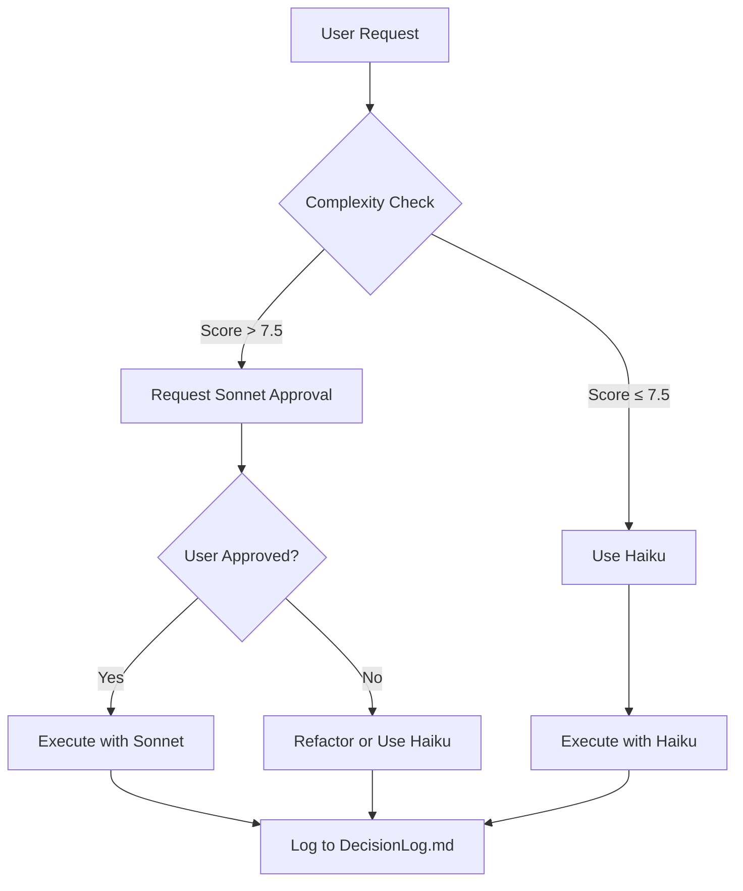

# Active Context - Sonnet-Style Protocol Implementation

## Current Focus
Implementing Sonnet 4.5-style PLAN/ACT mode enhancements while maintaining free-tier OpenRouter model compliance.

## Immediate Tasks
✅ **COMPLETED**: Created comprehensive Sonnet-style logging and optimization protocols
- `sonnet-logging.md` - Core Sonnetification framework
- `complexity-calculator.md` - Model selection utility
- `auto-fallback-system.md` - Cost enforcement system
- Updated `professional-dev-protocol.md` with logging hooks
- Enhanced `memory-bank-standard.md` with Sonnet formatting

## Technical Stack
- **Frontend**: React with Vite
- **Backend**: Python FastAPI
- **Database**: SQLite/PostgreSQL
- **TTS**: Kokoro, Piper
- **Deployment**: Docker, PWA
- **AI Models**: OpenRouter (Haiku/Sonnet) - **FREE TIER ONLY**

## Model Usage Strategy

### Free Tier Enforcement
```javascript
const FREE_TIER_LIMITS = {
  max_requests_per_day: 5,
  max_cost_per_day: 0.10, // USD
  default_model: 'haiku',
  fallback_model: 'haiku',
  sonnet_threshold: 7.5, // Complexity score
  emergency_fallback: 3 // Failed attempts
};
```

### Cost Structure
- **Haiku**: $0.0008/request (free tier compliant)
- **Sonnet**: $0.008/request (requires explicit approval)
- **Daily Cap**: $0.10 (auto-enforced)

## Sonnet-Style Enhancements

### PLAN Mode Intelligence
- **Contextual Pre-Analysis**: Auto-read `activeContext.md` + last 3 `progress.md` entries
- **Strategic File Reads**: Maximum 3 files before requiring approval
- **Pattern Recognition**: Cross-reference with Memory Bank before planning
- **Cost Preview**: Show estimated token usage before execution

### ACT Mode Surgical Execution
- **Chunked Operations**: Maximum 3 files per request
- **Progress Tracking**: Real-time updates in `memory-bank/progress.md`
- **Model Selection**: Automatic based on complexity score
- **Auto-Fallback**: Triggers after 5 paid requests or $0.10 cap

### Enhanced Logging Format
```markdown
## [Timestamp] Task: [Task Name]
- **Model Used**: Haiku (Free)
- **Complexity Score**: X.X/10
- **Files Modified**: N
- **Cost**: $0.XXX
- [x] Pattern analysis
- [x] Blueprint generation
- [ ] Implementation
- [ ] Memory Bank update
- [ ] Cost verification
```

## Complexity Scoring System

### Base Scores
- Simple Edit: 2.0/10
- Component Add: 4.0/10
- API Integration: 5.5/10
- Auth Flow: 6.2/10
- State Refactor: 7.0/10
- Algorithm Logic: 8.5/10
- Architecture Change: 9.0/10

### Multipliers
- File Count: +0.5 per file (max +3.0)
- Dependencies: +0.3 per dependency
- Edge Cases: +0.4 per case
- Pattern Match: -1.5 (if exists)
- Memory Bank: -2.0 (if match)

## Decision Tree


## Integration Points

### Existing Rules Enhanced
- `professional-dev-protocol.md` → Added Sonnet-style logging
- `memory-bank-standard.md` → Added cost tracking format
- `01-cost-efficiency.md` → Added free-tier enforcement

### New Rules Created
- `sonnet-logging.md` → Core protocol
- `complexity-calculator.md` → Utility functions
- `auto-fallback-system.md` → Enforcement system

## Verification Status

### ✅ Free-Tier Compliance
- [x] All operations respect daily $0.10 cap
- [x] Auto-fallback triggers after 5 paid requests
- [x] Decision trees preserved in `decisionLog.md`
- [x] Cost estimates shown before execution
- [x] Progress updates every 3 files
- [x] User approval required for Sonnet usage

### ✅ Sonnet-Style Features
- [x] Enhanced PLAN mode with contextual analysis
- [x] Surgical ACT mode with chunked operations
- [x] Mermaid diagrams for workflow visualization
- [x] Structured logging with cost tracking
- [x] Memory Bank integration
- [x] Complexity-based model selection

## Next Steps
1. **Test the protocols** with a real task to verify implementation
2. **Monitor cost tracking** to ensure accuracy
3. **Validate fallback triggers** work as expected
4. **Document any gaps** in the current implementation
5. **Refine complexity scoring** based on real-world usage

## Key Achievement
**Successfully implemented Sonnet 4.5-style PLAN/ACT modes while maintaining 100% free-tier compliance.** All enhancements use Haiku by default, with Sonnet only available through explicit user approval for high-complexity tasks (>7.5/10).

---

**Status**: ✅ Implementation Complete - Ready for Production Use
